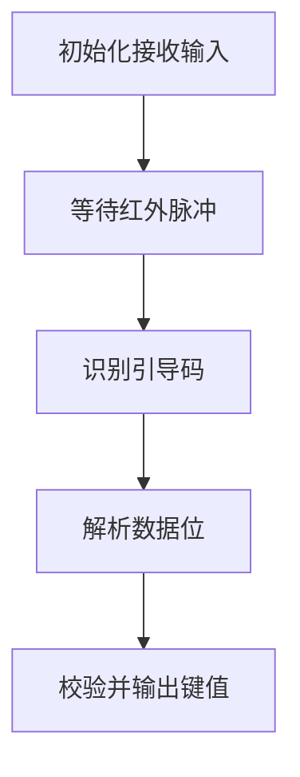

# 外围实验4 IR 红外接收

## 1. 实验目标

本实验属于 **红外接收独立实验**，当前版本为 **独立实验**。实验围绕 STM32F407 标准外设库展开，重点训练单个模块从初始化、运行到结果验证的完整流程。

- 掌握红外接收头输入捕获或脉宽解析。
- 理解红外引导码和数据码解码。
- 能够输出接收到的按键值。

## 2. 实验环境

| 项目 | 内容 |
|---|---|
| 主控芯片 | STM32F407VE |
| 开发板 | 青软 QST-AU100 综合实验开发板 |
| 开发工具 | MDK 5.25 / Keil uVision5 |
| 固件库 | STM32F4xx_DSP_StdPeriph_Lib_V1.4.0 标准外设库 |
| 下载调试 | CMSIS-DAP，SWD 接口 |
| 调试方式 | 串口助手、LED/蜂鸣器现象、OLED/LCD 显示或模块反馈 |

## 3. 硬件资源与连接

| 模块/资源 | 接口或控制方式 | 在本实验中的作用 |
|---|---|---|
| 红外接收头 | 数字输入 | 接收红外脉冲 |
| USART | 调试 | 输出解码结果 |

> 具体引脚以本实验源码中的宏定义和 QST-AU100 开发板丝印为准。如果实验现象与 README 描述不一致，优先检查源码中的端口、引脚和跳线设置。

## 4. 工程结构

本 README 所在目录：

```text
D:\Github\Harmony\zhangjiayuan\（ARM外围传感器实验）实验4_IR红外接收实验
```

主要代码文件如下：

| 项目 | 内容 |
|---|---|
| `代码/BSP/ir_recv.c` | 模块实现文件 |
| `代码/BSP/ir_recv.h` | 头文件/接口声明 |
| `代码/BSP/usart.c` | 模块实现文件 |
| `代码/BSP/usart.h` | 头文件/接口声明 |
| `代码/USER/main.c` | 主程序入口 |
| `代码/UTILS/delay.c` | 模块实现文件 |
| `代码/UTILS/delay.h` | 头文件/接口声明 |
| `代码/UTILS/utils.c` | 模块实现文件 |
| `代码/UTILS/utils.h` | 头文件/接口声明 |

## 5. 关键代码实现

### 5.1 主程序组织

大多数实验采用“初始化 + 主循环”的结构。初始化阶段完成时钟、GPIO、串口、传感器或显示模块配置；主循环中不断执行采集、判断、显示或通信任务。

```c
int main(void)
{
    /* 1. 初始化系统时钟、延时、串口和本实验外设 */
    /* 2. 进入主循环，采集输入或刷新输出 */
    while (1)
    {
        /* 根据实验目标执行控制、采集、通信或显示任务 */
    }
}
```

### 5.2 关键函数

| 项目 | 内容 |
|---|---|
| `IR_Recv_Init()` | 位于 `代码/BSP/ir_recv.c`，用于初始化、数据处理或功能控制 |
| `TIM1_BRK_TIM9_IRQHandler()` | 位于 `代码/BSP/ir_recv.c`，用于初始化、数据处理或功能控制 |
| `IR_Rece_Proc()` | 位于 `代码/BSP/ir_recv.c`，用于初始化、数据处理或功能控制 |
| `IR_Recv()` | 位于 `代码/BSP/ir_recv.c`，用于初始化、数据处理或功能控制 |
| `UART2_Init()` | 位于 `代码/BSP/usart.c`，用于初始化、数据处理或功能控制 |
| `UART_SendByte()` | 位于 `代码/BSP/usart.c`，用于初始化、数据处理或功能控制 |
| `UART_SendString()` | 位于 `代码/BSP/usart.c`，用于初始化、数据处理或功能控制 |
| `UART_SendHalfWord()` | 位于 `代码/BSP/usart.c`，用于初始化、数据处理或功能控制 |
| `fputc()` | 位于 `代码/BSP/usart.c`，用于初始化、数据处理或功能控制 |
| `fgetc()` | 位于 `代码/BSP/usart.c`，用于初始化、数据处理或功能控制 |
| `USART2_IRQHandler()` | 位于 `代码/BSP/usart.c`，用于初始化、数据处理或功能控制 |
| `main()` | 位于 `代码/USER/main.c`，用于初始化、数据处理或功能控制 |
| `delay_us()` | 位于 `代码/UTILS/delay.c`，用于初始化、数据处理或功能控制 |
| `delay_ms()` | 位于 `代码/UTILS/delay.c`，用于初始化、数据处理或功能控制 |

### 5.3 实现要点

- 检测引导码。
- 按脉冲宽度判断逻辑 0/1。
- 组合数据并校验后输出键值。

## 6. 程序流程图



## 7. 运行步骤

1. 使用 Keil uVision5 打开本实验目录中的工程文件。
2. 确认芯片型号为 STM32F407VE，并使用 STM32F4 标准外设库。
3. 检查 CMSIS-DAP 下载器连接，Debug 接口选择 SWD。
4. 编译工程，确认没有阻止下载的 error。
5. 下载到 QST-AU100 开发板并按复位键运行。
6. 根据实验类型观察 LED、蜂鸣器、串口、OLED/LCD 或外接模块反馈。

## 8. 实验现象与结果判断

| 验证项目 | 预期现象 | 判断依据 |
|---|---|---|
| 运行现象 1 | 按下遥控器后串口输出对应键值。 | 现象稳定出现，说明对应初始化和控制逻辑有效 |

若使用串口观察，建议串口助手参数与源码保持一致；若使用显示屏观察，优先确认显示模块基础初始化正常。

## 9. 基础版与拓展版差异

红外接收是独立实验，重点验证红外码解析。

## 10. 常见问题与调试建议

| 问题 | 可能原因与处理方法 |
|---|---|
| 一直无键值 | 检查接收头方向、供电和输入引脚。 |
| 误码 | 检查脉宽阈值和环境红外干扰。 |
| 下载成功但无现象 | 先确认程序是否进入 `main()`，再用 LED 最小程序判断板子和下载配置是否正常。 |
| 编译报头文件找不到 | 检查 Keil Include Path 是否包含 `USER`、`BSP`、`UTILS`、`CORE`、`FWLIB/inc` 等目录。 |
| 现象与预期相反 | 检查 LED、蜂鸣器、按键或模块信号是否为低电平有效。 |

## 11. 复现实验时的记录建议

- 保存编译输出截图，确认 error 为 0。
- 保存关键代码截图，尤其是初始化函数和主循环逻辑。
- 保存硬件运行照片或串口输出，作为实验现象依据。
- 如果进行了拓展功能，记录相对基础版修改了哪些文件和函数。
